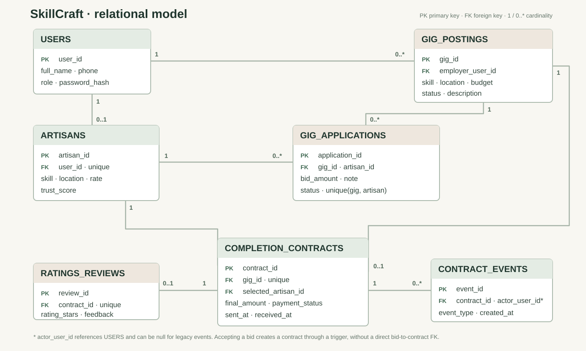
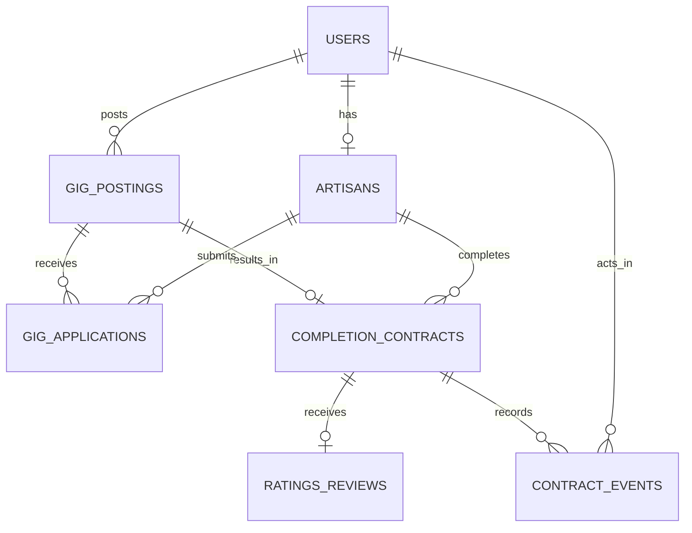

# SkillCraft Micro-Jobs: Entity-Relationship Diagram

## ER diagram



[Open full-size SVG](../docs/skillcraft-er-diagram.svg)

<details>
<summary>Relationship-only Mermaid version</summary>



</details>

---

## Table Descriptions

### **USERS**
The unified identity table for all platform participants. Stores login credentials (phone + password hash) and role assignment. Three roles:
- **artisan**: Can browse gigs, submit bids, complete work, receive ratings
- **employer**: Can post gigs, review applications, accept bids, leave ratings
- **admin**: Seeded demonstration role; user deactivation is not implemented

**Cardinality:** One user can be linked to at most one artisan profile (if they are an artisan), or multiple gig postings (if they are an employer).

---

### **ARTISANS**
Extends the USERS table with skill profile information. Every artisan record has exactly one corresponding USERS record (one-to-one via User_ID). Stores:
- Skill category (e.g., handloom weaving, plumbing, electrical work)
- Base location (small town/village name)
- Regional language
- Hourly rate (checked to be > 0)
- Trust score (0.00–5.00, cached from reviews on paid contracts)

**Cardinality:** One artisan can submit many applications (bids) on many gigs, and complete many contracts.

---

### **GIG_POSTINGS**
A job/gig posted by an employer. Represents work that needs to be done. Tracks:
- Employer (who posted it)
- Required skill
- Description and physical address
- Budget (checked to be > 0; may differ from final negotiated amount)
- Status: `open` (accepting bids) → `closed` (bid accepted, artisan assigned) or `cancelled` (employer withdrew)

**Cardinality:** One gig posting can receive multiple applications (bids) from different artisans, but results in at most one accepted contract.

---

### **GIG_APPLICATIONS**
In-progress bids submitted by artisans on gigs. Represents the negotiation phase:
- Which gig and which artisan
- Bid amount (checked to be > 0; can differ from gig budget)
- Application status: `pending` (waiting) → `accepted` (bid won, contract created) or `rejected` (declined)

**Design Note (3NF):** Kept separate from COMPLETION_CONTRACTS. This separation ensures:
- Negotiation data (who bid, how much they bid, pending/rejected states) never mixes with finalized transaction data
- No transitive dependencies; each table has a single, well-defined purpose
- Easy to query "active bids" without polluting contract history

**Cardinality:** Each artisan can bid once per gig (enforced by UNIQUE constraint), and each gig can receive bids from many artisans.

---

### **COMPLETION_CONTRACTS**
Accepted-work contracts. Created when a bid is accepted. Source of truth for:
- Final negotiated amount (may differ from original bid)
- Payment status: `pending` → `paid` or `disputed`. New contracts require the employer's payment-sent timestamp and the artisan's receipt timestamp before `paid`.
- Optional completion timestamp (not yet set through the UI)

**Cardinality:** An open or cancelled gig has no contract. An accepted bid produces one contract for its gig; a unique constraint prevents a second contract for that gig. One artisan can have many contracts. The accepted application is linked to the contract through the gig and selected artisan, not by a direct foreign key.

---

### **RATINGS_REVIEWS**
Feedback left by employers after a contract becomes paid. Drives the artisan's Trust_Score:
- Rating in stars (1–5)
- Optional feedback text
- One review per contract (enforced by UNIQUE constraint)

**Cardinality:** Each contract may receive one review. Reviews feed into the artisan's Trust_Score, which is recomputed via trigger after each new review.

---

### **CONTRACT_EVENTS**
Append-only events tied to a contract. An optional actor identifies who took each step; migrated historical paid rows receive a `legacy_record` event rather than an invented artisan confirmation. The database blocks updates and deletes to this table.

---

## Normalization (3NF Justification)

The six core tables are analyzed for **Third Normal Form (3NF)** in the [normalization guide](../docs/Normalization_Justification.md). The event table's relational columns depend on `Event_ID`; its JSONB detail is occasional metadata and would need typed fields if used for routine analysis.

1. **No repeating groups** (1NF): All attributes are atomic; no multi-valued fields.
2. **No partial dependencies** (2NF): All non-key attributes depend on the *entire* primary key, not just part of it.
3. **No transitive dependencies** (3NF): No non-key attribute depends on another non-key attribute.

**Key design decisions:**

- **USERS table added:** Unifies login, eliminating duplicate name/phone/password logic between artisans and employers.
- **ARTISANS is one-to-one with USERS:** User_ID is UNIQUE in ARTISANS, enforcing the relationship. Only artisans have an ARTISANS record; employers do not.
- **GIG_APPLICATIONS vs. COMPLETION_CONTRACTS:** Deliberately separate to avoid mixing negotiation state (bids, pending status) with finalized transaction data (settled amount, payment status). This eliminates transitive dependencies between bid-level and contract-level attributes.

---

## Key Constraints

- **Primary Keys:** SERIAL surrogate keys on all tables for fast joins and stable references.
- **Foreign Keys:** ON DELETE CASCADE ensures referential integrity; deleting a user cascades to their artisans, gigs, applications, and contracts.
- **CHECK Constraints:** Budget > 0, Hourly_Rate > 0, Bid_Amount > 0, Final_Amount > 0, Rating_Stars ∈ [1,5], Trust_Score ∈ [0.00, 5.00], Status ∈ {open, closed, cancelled}, etc.
- **UNIQUE Constraints:** Phone (no duplicate accounts), Email (optional but unique), ARTISANS(User_ID) (one-to-one), GIG_APPLICATIONS(Gig_ID, Artisan_ID) (each artisan bids once per gig), COMPLETION_CONTRACTS(Gig_ID) (one contract per gig), RATINGS_REVIEWS(Contract_ID) (one review per contract).
- **NOT NULL:** Critical fields like Full_Name, Phone, Password_Hash, Skill_Category, etc., are NOT NULL.

---

## Indexes for Performance

- `idx_gig_postings_status`: Fast lookup of open/closed/cancelled gigs
- `idx_gig_postings_skill`: Fast "find gigs by required skill" queries
- `idx_artisans_skill_location`: Composite index for "find artisans by skill AND location" (skill matching)
- `idx_gig_applications_gig`: Fast "find all bids on a gig" queries (for employer review)
- `idx_gig_applications_artisan`: Fast "find artisan's bids" queries
- `idx_completion_contracts_artisan`: Fast "find artisan's contract history"
- `idx_ratings_reviews_contract`: Fast "find review for a contract"

---

## Data Flow & Transactions

1. **User Registration:** INSERT into USERS; if artisan, also INSERT into ARTISANS.
2. **Gig Posting:** Employer INSERTs into GIG_POSTINGS (status='open').
3. **Bid Submission:** Artisan INSERTs into GIG_APPLICATIONS (status='pending').
4. **Bid Acceptance (Transaction-Safe):** 
   - BEGIN TRANSACTION
   - SELECT ... FOR UPDATE on GIG_POSTINGS row (locks against concurrent updates)
   - UPDATE GIG_APPLICATIONS set status='accepted'
   - UPDATE GIG_POSTINGS set status='closed'
   - INSERT into COMPLETION_CONTRACTS
   - UPDATE GIG_APPLICATIONS set status='rejected' for all other pending bids on same gig (via trigger)
   - COMMIT
5. **Payment:** UPDATE COMPLETION_CONTRACTS set Payment_Status='paid'.
6. **Review:** INSERT into RATINGS_REVIEWS; trigger recalculates ARTISANS.Trust_Score.

---

## Tools & Commands

**Load schema:**
```bash
psql skillcraft -f database/01_schema.sql
```

**View all tables:**
```sql
\dt
```

**View table structure:**
```sql
\d tablename
```

**View indexes:**
```sql
SELECT indexname FROM pg_indexes WHERE tablename = 'tablename';
```

**View comments:**
```sql
SELECT description FROM pg_description WHERE objid = (SELECT oid FROM pg_class WHERE relname='tablename');
```
